# Audit 1 — Marketing & Commercial (vitrine + tunnel de réservation)

> **Persona auditrice** : *Sophie R., responsable commerciale fret maritime, 15 ans
> dont 8 chez un commissionnaire de transport. Elle vend de la cale, pilote un
> pipeline Pipedrive, et connaît les portails Maersk / CMA CGM par usage quotidien.*
> **Mandat** : évaluer si la vitrine répond aux besoins/attendus clients, si le
> prospect accède aux informations qu'il recherche, dérouler un parcours de
> réservation sur une route ouverte, comparer avec les grands acteurs du marché.
> **Conventions** : voir [README](README.md) (sévérités, [F]/[J], IDs `COM-xx`).

---

## 1. La grille d'attentes d'un prospect B2B

Ce qu'un chargeur (ou transitaire) cherche, dans l'ordre où il le cherche [J] :

| # | Attente | Question du prospect | Où ça se joue |
|---|---------|----------------------|----------------|
| A1 | Crédibilité | « Êtes-vous un armateur réel, fiable, assuré ? » | Landing, flotte, à-propos, presse |
| A2 | Offre & routes | « Desservez-vous mon couple POL/POD, à quelles dates ? » | `/routes`, fiches legs |
| A3 | Prix | « Combien pour N palettes ? » — *sans engagement* | Fiche route, devis |
| A4 | Capacité & délai | « Reste-t-il de la place ? Quel transit time ? » | Fiche route |
| A5 | Conditions | « CGV, annulation, assurance marchandise, IMDG ? » | About/terms, wizard |
| A6 | Preuve environnementale | « Que vaut l'argument CO₂ ? » (traité au volet 2) | Impact, méthodologie |
| A7 | Contact rapide | « Un humain peut-il me répondre vite ? » | Contact, téléphone |
| A8 | Preuve sociale | « Qui expédie déjà avec vous ? » | Témoignages, actualités |

## 2. Revue de la vitrine — verdict page par page

Inventaire complet vérifié dans `app/routers/public_router.py`, `vitrine_router.py`
et `app/templates/public/` (22 templates).

| Page | Attente servie | Verdict | Commentaire |
|---|---|---|---|
| `/` landing | A1, A2, A3 | ✅ **Fort** | Hero clair, carrousel des 6 prochains legs réservables **avec jauge de capacité et prix/palette** — aucun vélique concurrent ne montre ça [J] |
| `/routes` + filtres pays/dates | A2, A3, A4 | ✅ Fort | Cartes legs : capacité restante, distance, durée, % CO₂, prix |
| `/routes/{leg_code}` détail | A2–A4 | ✅ Fort | Timeline POL→POD, agent portuaire, carte, cut-off, CTA réserver, éco-calculateur |
| `/fleet` tracker public | A1 | ✅ Différenciant | Positions réelles des navires en carte publique — fort marqueur de « flotte qui navigue » |
| `/flotte`, `/navigation` | A1 | ✅ | Spécifications TSC 80, stratégie de routage |
| `/impact`, `/about/anemos` | A6 | ✅ | Voir volet 2 — niveau de transparence méthodologique inhabituel |
| `/about/terms`, `/legal`, `/privacy` | A5 | 🟡 Moyen | CGV présentes mais **politique d'annulation chiffrée absente** (la spec booking §4.3 prévoyait 0/25/50/100 % selon J-30/J-7/J-2) |
| `/contact` | A7 | 🟡 Moyen | Bon formulaire de cotation (POL/POD/volume/dates, RGPD, honeypot)… mais voir COM-04 : le lead n'est notifié à personne |
| `/actualites`, `/carnet` | A8, A1 | 🔴 Vide | Modèle `BlogPost` et routes opérationnels, **zéro contenu publié** — pages vides visibles des prospects et de Google [F] |
| `/presse`, `/recrutement` | A1 | ✅ | Présents |
| `/passagers` | — | ⚪ | Page active (`vitrine_router.py:55-57`) alors que CLAUDE.md déclare le module passagers supprimé en v3.0.0 — clarifier le statut de l'offre (COM-11) |
| Témoignages clients, logos références, FAQ | A8 | 🔴 Absent | Aucun template ne porte de preuve sociale client [F] |

**Lecture d'ensemble** [J] : le **fond** est au-dessus du standard du secteur
vélique (prix publics, capacité temps réel, tracker public). Les manques sont des
manques d'**exploitation commerciale** : preuve sociale, contenus, conditions
d'annulation, et surtout la suite du parcours (§3).

### Langues — un point structurel pour des routes export

Le sélecteur de langue existe (`/lang/{lang}`, cookie `towt_lang`, 5 langues
déclarées) mais les gabarits publics sont essentiellement rédigés en français en
dur ; seule `/about/anemos` est réellement bilingue FR/EN [F]. Pour des routes
France → USA / Brésil dont le **notify party et le consignee sont anglophones ou
lusophones**, c'est une barrière d'achat (COM-07).

## 3. Parcours de réservation simulé — route ouverte

Déroulé tel que le code le produit, pour « 24 palettes EPAL de vin, Fécamp → New
York » ; les points de friction sont notés **F1…F9**.

```mermaid
flowchart LR
    P0["Landing /"] --> P1["/routes recherche"]
    P1 --> P2["/routes/LEG fiche route<br/>prix + capacité + CO2"]
    P2 -->|"CTA Réserver"| W["MUR : /me/login requis"]
    W -->|"créer un compte"| P3["/me/register"]
    P3 --> S1["/booking/new<br/>étape 1 : choix du leg"]
    S1 --> S2["/booking/new/LEG<br/>étape 2 : palettes + adresses"]
    S2 --> S3["/booking/REF/confirm<br/>étape 3 : récap + CGV"]
    S3 --> S4["/booking/REF/done"]
    S4 -.->|"4 h ouvrées promises"| BO["Backoffice staff :<br/>confirm → facture virement 30 j"]
    style W fill:#7a1f1f,color:#fff
```



| Étape | Ce que voit le prospect | Verdict |
|---|---|---|
| 0. Landing → fiche route | Prix « à partir de X €/palette », jauge capacité, durée, agent portuaire, badge CO₂ | ✅ Excellent niveau d'information pré-engagement |
| 1. Clic « Réserver cette traversée » | **Redirection login/register** : email, mot de passe ≥ 12 caractères, société, pays | 🔴 **F1** — Les 3 étapes du wizard exigent `get_current_client` (`booking_router.py:47-49, 113, 149`). La spec ([booking §3.1](../../booking/01-cale-booking-platform.md)) et le persona « David » prévoyaient l'inscription **à l'étape 3**, après l'engagement. Au moment le plus volatil du parcours, on demande l'effort maximal. |
| 1bis. Pas d'alternative | Aucun « devis sans compte », pas de chatbot public (le `/chat` Kairos est staff-only, `chat_router.py:23`) | 🔴 **F2** — Le prospect pressé bascule sur `/contact`… |
| 1ter. Formulaire contact | Formulaire complet, merci, et puis rien | 🟠 **F3** — `ContactRequest` est persisté sans **aucune notification** à l'équipe ni sync Pipedrive (`utils/pipedrive.py` jamais appelé depuis ce flux) [F]. Le SLA implicite d'une cotation fret est < 4 h ouvrées [J]. |
| 2. Étape 1 wizard | 20 prochains legs réservables, CO₂/palette | ✅ propre |
| 3. Étape 2 cargo | Lignes palettes (format, nb, poids, description), stackable, dangereux ; adresses pickup/delivery | 🟡 **F4** — champs `imdg_class`, `un_number`, `hs_code` existent au modèle mais **ne sont pas collectés** ; pas d'upload FDS pour l'IMDG (la spec §4.4 l'exigeait avant confirmation) |
| 4. Étape 3 récap | Sous-total, majoration dangereux +25 %, frais doc 50 €, TVA 20 %, CGV v2026.1 | ✅ transparent · 🟡 **F5** — TVA 20 % systématique, y compris export hors UE (exonération art. 262 CGI non gérée) [J à valider fiscalement] |
| 5. Done + emails | « Confirmation sous 4 h ouvrées », notification + email client | ✅ bon ton · 🟡 **F6** — la promesse 4 h n'est **mesurée nulle part** (pas d'horodatage SLA backoffice, cf. volet 3) |
| 6. Confirmation staff | Facture auto (virement, 30 j), email | 🟠 **F7** — pas de paiement en ligne (Stripe retiré en V3.1 sans remplaçant) ; `paid_at` jamais renseigné : ni relance, ni rapprochement, ni blocage re-réservation d'un impayé [F] |
| 7. Suite de vie | loaded / at_sea / discharged / delivered visibles sur `/me/track/{ref}` | 🟡 **F8** — ces statuts n'avancent que par **clic backoffice**, pas par les événements réels du voyage (cf. FLX-02) ; le tracking client peut afficher « chargé » alors que le navire est parti |
| Capacité | Réservation `draft` ne décompte rien ; verrou uniquement à la confirmation staff | 🟡 **F9** — deux prospects peuvent composer le même reliquat ; acceptable à faible volume, à documenter commercialement [J] |

**Prix par défaut** : si un leg ouvert n'a pas de `public_price_per_palette_eur`,
le wizard tarife à `DEFAULT_BASE_PRICE_EUR = 38 €` (`services/pricing.py:38`) [F].
Un défaut silencieux de saisie planning peut donc **vendre une traversée
transatlantique à 38 €/palette** (COM-03).

## 4. Benchmark — « la même exigence que la grande conteneurisation »

Sources : recherche web 2026-06-12 — [Maersk Spot](https://www.maersk.com/transportation-services/maersk-spot),
[Maersk Emissions Studio](https://www.maersk.com/digital-solutions/emissions-dashboard),
[ECO Delivery Ocean](https://www.maersk.com/transportation-services/eco-delivery/ocean),
[Neoline](https://www.neoline.eu/en/), [Windshift](https://www.windshift.fr/en),
[secteur vélique 2026](https://figaronautisme.meteoconsult.fr/actus-nautisme-bateaux/2026-04-01/87037-transport-cargo-a-la-voile-ou-en-est-vraiment-le-secteur-en-2026),
[LSA sur Grain de Sail](https://www.lsa-conso.fr/le-fret-maritime-hisse-les-voiles,455605) ;
benchmark CMA CGM préexistant dans [`docs/booking/01`](../../booking/01-cale-booking-platform.md).

### 4.1 Capacités numériques vs leaders conteneur

| Capacité (standard leaders) | Référence marché | NEWTOWT — état réel vérifié |
|---|---|---|
| Devis instantané **sans compte** | Hapag-Lloyd Quick Quotes ; Maersk Spot affiche prix ferme + chargement garanti avant login | ❌ Rien sans compte (F1/F2) |
| Prix ferme + garantie de chargement | Maersk Spot (« certainty of instant prices and guaranteed loading ») | 🟡 Prix indicatif à l'étape 3 ; la confirmation reste manuelle sous 4 h (jamais mesurée) |
| Recherche horaires / routes publique | Tous | ✅ `/routes` avec capacité — **au-dessus du standard** (les leaders ne montrent pas la capacité restante) |
| Paiement en ligne / compte courant | Tous (carte, virement intégré, credit terms) | ❌ Facture PDF + virement non suivi (F7) |
| Tracking colis/conteneur temps réel | myMSC, Maersk Hub | 🟡 Carte navire réelle ✅, mais jalons booking manuels (F8) |
| Documentation self-service (BL, facture) | Tous | ✅ BL / packing list / facture / certificat en PDF auto |
| Dashboard émissions client | Maersk Emissions Studio (ISO 14083, multi-transporteurs) | 🟡 Cumul CO₂ + certificats par expédition ✅ ; pas d'export annuel consolidé (volet 2) |
| API B2B documentée + webhooks | Tous (EDI/API) | ❌ API v1 lecture seule, pas de création de booking, pas de webhooks sortants (`api_v1_router.py`) |
| Alertes proactives (retard, ETA shift) | ZIM ZIMonitor | ❌ ETA shift = notification interne staff uniquement, le client n'est pas averti (FLX) |

### 4.2 Positionnement vs pairs véliques

| Acteur | Ce qu'il montre publiquement | Leçon pour NEWTOWT |
|---|---|---|
| **Neoline** (Neoliner Origin, 136 m, −80 %) | Marque B2B forte, références clients industrielles (logos) | La preuve sociale par références est le nerf de la guerre — NEWTOWT n'en affiche aucune (COM-12) |
| **Grain de Sail** | Marque B2C/B2B intégrée, storytelling produit | Le carnet/blog vide est un actif gâché |
| **Windcoop** | Transparence coopérative, ligne Marseille–Madagascar | Transparence prix/capacité : NEWTOWT est déjà devant [J] |
| Secteur 2026 | Consolidation, défaillance d'un pionnier | La vitesse de conversion prospect→cash est une question de survie, pas d'optimisation |

**Conclusion benchmark** [J] : NEWTOWT a déjà construit ce que les véliques n'ont
pas (catalogue + capacité + prix publics + tracker). Ce qui manque pour tenir la
comparaison « grands acteurs » revendiquée par la vision tient en quatre briques :
**devis sans compte, inscription tardive, encaissement, jalons automatiques**.

## 5. Constats et recommandations

| ID | Sév. | Constat [F sauf mention] | Preuve | Recommandation | Priorité / effort |
|---|---|---|---|---|---|
| COM-01 | 🔴 | Compte obligatoire dès l'étape 1 du wizard, contraire à la spec (inscription étape 3) | `booking_router.py:47-49,113,149` | Wizard invité : étapes 1-2 sans auth (session anonyme), création de compte fusionnée à l'étape 3 | **P0** · M |
| COM-02 | 🔴 | Aucun devis instantané public | `pricing.compute_quote` non exposé | « Obtenir un prix » sur la fiche route : nb palettes + format → prix indicatif + CTA réserver. Zéro nouveau calcul à écrire | **P0** · S |
| COM-03 | 🟠 | Tarif par défaut 38 €/palette appliqué silencieusement si prix public absent | `pricing.py:38` | Refuser l'ouverture booking (`is_bookable`) sans prix public renseigné ; alerte planning | **P0** · S |
| COM-04 | 🟠 | Leads `/contact` sans notification équipe ni push Pipedrive ; statut `new→contacted→qualified` jamais outillé côté staff | `vitrine_router.py` POST ; `utils/pipedrive.py` non câblé | Email + notification interne à chaque lead ; création organisation+deal Pipedrive ; mini-vue staff « leads » | **P0** · S |
| COM-05 | 🟠 | Pas d'encaissement ni suivi de paiement ; `paid_at`/`overdue` jamais alimentés | `services/invoicing.py` | Court terme : statut payé manuel + relances J+30/J+45. Moyen terme : réintroduire un PSP (virement initié ou carte) | **P1** · M |
| COM-06 | 🟠 | Deux pipelines de vente parallèles (orders vs bookings) : le commercial n'a pas de vue unifiée du remplissage ni du CA par leg | cf. [volet 3, FLX-01](03-audit-fonctionnel-flux.md) | Décision produit d'unification (cf. volet 4, arbitrage A1) | **P1** · L |
| COM-07 | 🟡 | Vitrine monolingue de fait (FR), catalogues en/es/pt-br/vi squelettiques | `templates/public/*`, `app/i18n/` | Prioriser EN intégral sur landing/routes/booking ; PT-BR ensuite (axe Brésil) | **P1** · M |
| COM-08 | 🟡 | Politique d'annulation absente (spec : 0/25/50/100 % J-30/J-7/J-2) ; route `charge-cancellation-fee` non implémentée | spec booking §4.3 vs `staff_booking_router.py` | Publier la politique dans CGV + l'implémenter dans le cycle de vie | **P2** · M |
| COM-09 | 🟡 | Réservations `draft` ne gèlent pas la capacité ; pas de purge des drafts > 7 j (prévue par spec) | `capacity.py:47-53` | Option courte : TTL d'option 48 h décomptée. Documenter le choix | **P2** · S |
| COM-10 | 🟡 | Aucun nurturing : pas de relance panier abandonné, pas de newsletter | absence vérifiée | Relance J+1 sur draft ; capture email simple sur landing | **P2** · S |
| COM-11 | ⚪ | Page `/passagers` active vs interdiction CLAUDE.md du module passagers | `vitrine_router.py:55-57` | Trancher : offre PAX assumée (12 places) ou retrait de la page | P2 · S |
| COM-12 | ⚪ | Zéro preuve sociale (témoignages, références, certifications) ; blog vide | `templates/public/` | 3 études de cas clients + logos ; alimenter `/carnet` (chantier navires = excellent storytelling) | **P1** · S (contenu) |
| COM-13 | 🟡 | Promesse « confirmation sous 4 h » non mesurée ; jalons client manuels | emails `booking_event` ; F8 | Horodater submitted→confirmed (KPI), câbler les jalons sur les événements réels (cf. FLX-02) | **P1** · M |

## 6. Funnel à instrumenter (mesure de la conversion)

Aujourd'hui, **aucune mesure du funnel n'existe** (pas d'événements analytics
côté public) [F]. Minimum vital, en cohérence avec les KPI de
[`docs/booking/01 §9`](../../booking/01-cale-booking-platform.md) :

```
visite landing → vue fiche route → clic Réserver → (mur compte) → étape 1 → étape 2 → étape 3 → submitted → confirmed → payé
```

KPI cibles (vision produit) : conversion landing→booking ≥ 5 %, délai
submitted→confirmed < 4 h, % réservations self-service ≥ 30 % à 6 mois.

---

*Volet suivant : [02 — marketing environnemental & RSE](02-audit-marketing-environnemental.md).*
