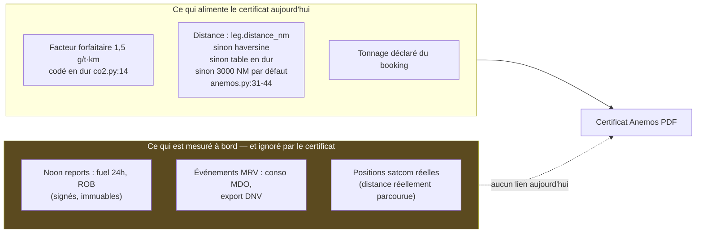

# Audit 2 — Marketing environnemental & preuve RSE

> **Persona auditrice** : *Maëlle V., responsable marketing & RSE. Elle a piloté un
> reporting CSRD côté chargeur : elle sait ce qu'un auditeur demande quand une
> entreprise inscrit « fret décarboné » dans son rapport extra-financier.*
> **Mandat** : la vitrine répond-elle aux attendus, notamment sur les engagements
> environnementaux ? Dérouler le parcours d'une **réservation déjà effectuée** et
> identifier les marqueurs/indicateurs dont a besoin un acheteur devant **prouver**
> la sensibilité RSE de son achat.
> **Conventions** : voir [README](README.md). IDs `ENV-xx`.

---

## 1. Ce que l'acheteur RSE doit pouvoir prouver

L'acheteur type n'est pas un militant : c'est un responsable achats/logistique à
qui sa direction RSE demande des **données opposables** pour le Scope 3. Ses
référentiels :

| Référentiel | Ce qu'il exige concrètement du transporteur | Où ça se joue dans `mynewtowt` |
|---|---|---|
| **GHG Protocol Scope 3, cat. 4** (transport amont) | kg CO₂e par expédition, méthode documentée, facteurs sourcés | Certificat Anemos, `/about/anemos` |
| **CSRD / ESRS E1** | Données auditables : périmètre (well-to-wake vs tank-to-wake), année, méthode, **vérifiabilité tierce** | Certificat + méthodologie |
| **ISO 14083:2023 / GLEC Framework** | Standard de calcul des émissions transport — *celui que les acheteurs citent* (Maersk Emissions Studio s'affiche « aligned with ISO 14083 » — [source](https://www.maersk.com/digital-solutions/emissions-dashboard)) | Absent aujourd'hui |
| **Bilan Carbone® / Base Empreinte ADEME** (France) | Facteurs compatibles, kgCO₂e | Certificat (mentionne « Bilan Carbone® scope 3 cat. 4 » sur `/me/anemos`) |
| **EU MRV (UE 2015/757)** | Données navire vérifiées par un organisme accrédité | Module MRV interne + mention sur le certificat |

**Test de l'auditeur** [J] : pour chaque allégation chiffrée, il pose 4 questions —
*d'où vient le chiffre ? qui l'a vérifié ? est-il mesuré ou théorique ? puis-je le
retrouver dans un registre ?* C'est la grille du §5.

## 2. La vitrine sous l'angle environnemental

### 2.1 Forces — un niveau de transparence rare

- **`/about/anemos` (424 lignes, bilingue FR/EN)** : la page publie le facteur
  d'émission (1,5 g CO₂/t·km), la référence conventionnelle (13,7 g, « IMO Fourth
  GHG Study »), **la formule complète** `(13,7 − 1,5) × tonnage × distance ÷ 1000`,
  un exemple chiffré (1,2 t de vin, 3 200 NM → 86,7 kg évités), et l'ancrage
  « EU MRV + GHG Protocol Scope 3 cat. 4 » [F]. Peu d'acteurs, même conteneurs,
  publient leur formule [J].
- **Éco-calculateur public** sur chaque fiche route (tonnage → CO₂ évité, live JS) [F].
- **`/impact`** : argumentaire qualité cargo (cales à température de mer,
  ventilation 6 vol/h, système de capteurs LACOE©) qui relie environnement et
  **qualité produit** — bon angle B2B agroalimentaire [J].
- **CO₂ visible à chaque étape du parcours d'achat** : badge sur les cartes legs,
  la fiche route, l'étape 1 du wizard — conforme au principe « CO₂ mis en avant à
  chaque étape » de la spec booking [F].

### 2.2 Faiblesses

- **Chiffres incohérents** : « −95 % » (landing `landing.html:13-14`, `/impact`)
  vs « −89 % » (fiches routes, `/about/anemos`, certificat). Les deux coexistent
  publiquement [F]. Premier réflexe d'un acheteur attentif : « lequel est vrai ? » → **ENV-01**.
- **Pas de page « preuves & certifications »** : aucun document tiers
  téléchargeable (attestation du vérificateur, rapport MRV annuel, statuts du
  « label »), aucune FAQ acheteur RSE [F].
- **Référentiel manquant** : ni ISO 14083, ni GLEC ne sont cités ; le périmètre
  (WtW/TtW) n'est précisé nulle part ; tout est exprimé en **CO₂** et jamais en
  **CO₂e** (CH₄/N₂O exclus sans le dire) [F] → **ENV-05**.
- **« Label ANEMOS »** : présenté comme un label, sans registre public, propriétaire
  du référentiel, ni numéro de certificat vérifiable — juridiquement un
  auto-label [J] → **ENV-08**. À l'heure de la directive *Green Claims* et de la
  jurisprudence anti-greenwashing, l'écart entre « label » et « auto-déclaration »
  est un risque réputationnel.

## 3. Parcours simulé — une réservation déjà effectuée

Persona cliente : brasserie exportatrice (cf. persona « Léa »), booking
`BK-2026-xxxx` Fécamp → New York **livré**. Je déroule ce que la cliente vit,
moment par moment, tel que le code le produit.

| Moment de vérité | Ce que voit la cliente | Verdict RSE |
|---|---|---|
| Email « Réservation confirmée » | Facture virement, lien dashboard | 🟡 Aucun rappel du bénéfice CO₂ à venir — moment idéal pourtant [J] |
| `/me` dashboard | KPI « CO₂ évité cumulé » (somme des certificats), segment, expéditions actives | ✅ Le cumul est le bon indicateur fidélisation ; c'est la North Star produit |
| `/me/track/{ref}` | Carte position réelle du navire + timeline des jalons | ✅ fort storytelling · 🟡 jalons avancés à la main (cf. COM-13/FLX-02) : « at_sea » peut être faux le jour J |
| Email « Cargaison débarquée » | « …label Anemos disponible » | ✅ **Le certificat est émis automatiquement au débarquement** (`booking_lifecycle.py` → `anemos.issue_for_booking`, idempotent) — c'est LE différenciant du parcours [F] |
| `/me/anemos` | Tableau : tonnage, distance, CO₂ vélique, CO₂ conventionnel, **CO₂ évité**, PDF par expédition. Mention « valorisable dans votre Bilan Carbone® scope 3 catégorie 4 » | ✅ exactement ce que cherche l'acheteuse |
| PDF certificat | Bénéficiaire (société, TVA), voyage (leg, navire, IMO, route), tableau d'émissions avec facteurs, méthodologie en pied, « mesures embarquées + audit vérificateur tiers accrédité » | 🟠 Voir §4 : la promesse de mesure n'est pas tenue par le calcul réel |
| `/me/documents` | BL, packing list, facture, label Anemos groupés par expédition | ✅ dossier de preuve complet en 1 écran |
| Fin d'année (rapport RSE) | …rien : pas d'export annuel consolidé (CSV/PDF) multi-expéditions | 🔴 **ENV-06** — l'acheteuse refait l'addition à la main depuis N PDFs ; la North Star (« rapport CO₂ téléchargé ») n'a pas d'objet à télécharger au niveau annuel |

## 4. Robustesse de la preuve — le point dur

Le certificat **annonce** : *« Émissions NEWTOWT : mesures embarquées + audit
vérificateur tiers accrédité »*. Le calcul **réel** est :

Conséquences pour un audit client [J] :

1. Deux expéditions sur la même route ont **toujours** le même CO₂/t, que la
   traversée ait consommé 0 ou 40 t de MDO au moteur — le « mesuré » ne corrige
   jamais le « théorique ».
2. Si les ports sont mal référencés, la distance retombe sur **3 000 NM
   forfaitaires** (`anemos.py:44`) sans aucune mention sur le certificat [F].
3. Le facteur 1,5 g/t·km est **invérifiable en interne** : constante Python, sans
   date de validité, sans source jointe, alors que la spec V3.0 prévoyait une table
   `co2_variables` versionnée (`effective_date`, `is_current`) administrable —
   disparue du modèle V3 [F].

Ce n'est pas un problème d'honnêteté (le facteur peut être juste) : c'est un
problème de **chaîne de preuve**. Le jour où un client CSRD demande l'attestation
du vérificateur et la réconciliation mesuré/déclaré, la réponse n'est pas dans le
produit.

## 5. Inventaire des marqueurs RSE — trouvé / manquant

| Marqueur attendu par l'acheteur | Présent ? | Détail |
|---|---|---|
| CO₂ évité par expédition, nominatif | ✅ | Certificat Anemos auto à `discharged` |
| Cumul annuel par client | 🟡 | Affiché au dashboard, **pas exportable** (ENV-06) |
| Facteurs publiés + formule | ✅ | `/about/anemos` — au-dessus du marché |
| Source des facteurs | 🟡 | « IMO Fourth GHG Study + IFP EN » cités, sans lien/édition |
| Périmètre WtW vs TtW | ❌ | Jamais précisé (ENV-05) |
| CO₂e (tous GES) | ❌ | CO₂ uniquement, non dit |
| ISO 14083 / GLEC | ❌ | Non cités (le standard que les acheteurs exigent en 2026) |
| Vérificateur tiers nommé + attestation | ❌ | « accrédité » sans nom ni document (ENV-04) |
| Identifiant vérifiable du certificat (n° de série, QR, registre) | ❌ | Référence interne seulement, aucune vérification externe possible |
| Données mesurées (fuel réel, route réelle) | ❌ | Collectées (noon/MRV/tracking) mais non utilisées (ENV-03) |
| Rapport MRV annuel public | ❌ | Module MRV interne ; rien de publié |
| Empreinte du reste de la chaîne (pré/post acheminement) | ❌ | Hors périmètre affiché — à assumer explicitement [J] |

## 6. Constats et recommandations

| ID | Sév. | Constat | Preuve | Recommandation | Priorité / effort |
|---|---|---|---|---|---|
| ENV-01 | 🟠 | « −95 % » et « −89 % » coexistent publiquement | `landing.html` vs `about_anemos.html`/fiches routes | Une seule vérité : % calculé par route (la formule le permet), « jusqu'à −95 % » réservé au cas justifiable et sourcé | **P0** · S |
| ENV-02 | 🔴 | Facteurs d'émission en dur, sans versionnage ni gouvernance ; table `co2_variables` de la spec disparue | `co2.py:14-16` ; NOTE PCA §12.A | Re-créer la config versionnée en base (valeur, unité, source, `effective_date`, vérificateur), admin UI, et timbrer chaque certificat avec la version de facteur utilisée | **P0** · M |
| ENV-03 | 🟠 | Certificat = facteur forfaitaire × distance plan (repli 3 000 NM) ; jamais réconcilié avec fuel mesuré ni route réelle | `anemos.py:31-44` ; §4 | Étape 1 : afficher « méthode : facteur certifié × distance orthodromique » sur le PDF (honnêteté immédiate). Étape 2 : réconciliation annuelle mesuré/théorique publiée. Étape 3 : certificat alimenté par MRV réel (cf. [volet 3, FLX-03](03-audit-fonctionnel-flux.md)) | **P0** (étape 1) · S→L |
| ENV-04 | 🟠 | Vérification tierce revendiquée sans vérificateur nommé, attestation, ni n° vérifiable | PDF certificat | Nommer l'organisme, joindre l'attestation téléchargeable, ajouter n° de série + QR de vérification (`/verify/{ref}` public) | **P1** · M |
| ENV-05 | 🟡 | Ni ISO 14083/GLEC, ni WtW/TtW, ni CO₂e | templates publics + PDF | Mettre la méthodologie au format ISO 14083 (l'écart méthodologique est faible, l'écart de crédibilité est énorme [J]) | **P1** · M |
| ENV-06 | 🟡 | Pas d'export annuel consolidé par client (PDF/CSV) | `client_dashboard_router.py` | « Rapport CO₂ annuel » 1 clic depuis `/me/anemos` (agrégat + liste des expéditions + méthodo) — c'est littéralement la North Star produit | **P1** · S |
| ENV-07 | 🟡 | Hypothèse 0,5 t/palette du CO₂ affiché en étape 1 non explicitée ; « −89 % » parfois en dur dans le template | `booking_step1`, `route_detail.html` | Note de bas de page + recalcul à l'étape 2 avec le tonnage réel saisi | **P2** · S |
| ENV-08 | ⚪ | « Label ANEMOS » sans statut de label (registre, référentiel public) | `/impact`, certificat | Soit l'assumer comme « certificat d'émissions évitées NEWTOWT » (renommer), soit constituer le label (référentiel publié + tiers) | **P1** (décision) |
| ENV-09 | ⚪ | Empreinte du site lui-même : 200 Ko de fonts Google + CDN tiers sur chaque page | `base.html` (cf. [volet 4, ARC-02](04-proposition-architecture.md)) | Auto-héberger : cohérence sobriété + RGPD + performance | P2 · S |

## 7. Quick wins marketing (hors refonte)

1. **Page « Preuves »** (`/about/preuves`) : attestation vérificateur, rapport MRV
   annuel, version des facteurs, FAQ acheteur RSE (WtW ? CO₂e ? double comptage ?
   insetting ?). C'est une page statique : une journée de travail, un actif
   commercial permanent [J].
2. **Rapport CO₂ annuel téléchargeable** (ENV-06) — réutilise WeasyPrint et les
   certificats existants.
3. **Harmonisation des % CO₂** (ENV-01) + note méthodologique sur chaque chiffre.
4. **Kit RSE acheteur** en PDF co-brandable (l'acheteur veut briller en interne :
   lui donner les slides, c'est accélérer sa décision [J]).
5. Mentionner les certificats Anemos **dans l'email de confirmation** de booking
   (le bénéfice avant la traversée, pas seulement après).

---

*Volet suivant : [03 — audit fonctionnel des flux](03-audit-fonctionnel-flux.md).*
