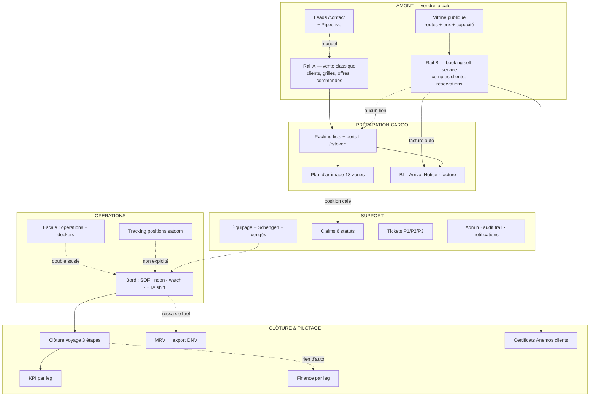
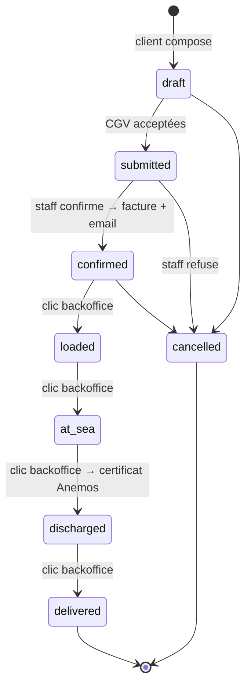
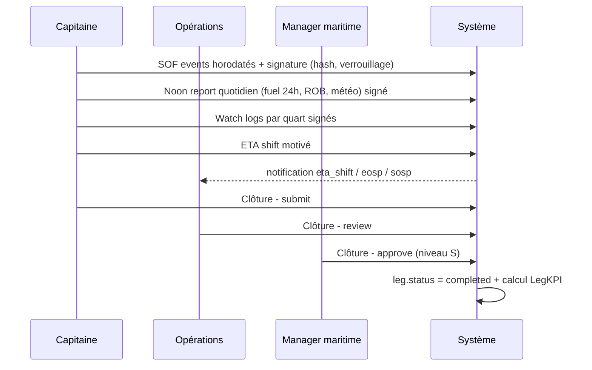

# Audit 3 — Audit fonctionnel : cartographie des flux de gestion & opérationnels

> **Mandat** : schématiser l'intégralité des flux de gestion et flux opérationnels
> actifs, afin de **confirmer / challenger / conforter** les modes opératoires du
> logiciel, puis ouvrir un champ de propositions pour adapter/compléter le champ
> d'application des outils existants, métier par métier.
> **Méthode** : pour chaque flux, confrontation du **prescrit** (la
> [note de continuité opérationnelle](../../strategy/NOTE_TECHNIQUE_CONTINUITE_OPERATIONNELLE.md),
> qui documente les modes opératoires module par module) et du **réalisé** (le code,
> références `fichier:ligne`). IDs `FLX-xx`, conventions du [README](README.md).

---

## 1. Cartographie macro — la chaîne de valeur

**Légende** : flèches pleines = automatisé ; **pointillés = rupture** (ressaisie
manuelle ou absence de lien). La suite de ce document parcourt chaque pointillé.

## 2. Le constat structurant : deux rails de vente parallèles

| | Rail A — « commercial » (hérité V2) | Rail B — « booking » (V3) |
|---|---|---|
| Référentiel client | `clients` (FF/shipper, Pipedrive) | `client_accounts` (auth, MFA, segment) |
| Objet de vente | `orders` + `order_assignments` | `bookings` + `booking_items` |
| Tarification | Grilles `rate_grids` (brackets volume, formule OPEX) | `public_price_per_palette_eur` + coefficients format + surcharges (`pricing.py`) |
| Facturation | **Manuelle** (aucune génération) | **Automatique** à la confirmation (`invoicing.py`) |
| Documents | Packing list + portail token + BL Word | BL/PL/facture/Anemos PDF |
| Certificat CO₂ | Aucun | Automatique à `discharged` |
| Capacité du leg | **Non décomptée** | Décomptée (`capacity.py:86-90`) |

### FLX-01 🔴 — Survente structurelle possible [F]

`get_available_capacity()` ne somme que `Booking.total_palettes`
(`capacity.py:86-90`). Une commande du rail A affectée à un leg (`orders.leg_id`)
**n'entame jamais** la capacité publique. Rien n'interdit d'ouvrir au booking
public (`is_bookable`) un leg déjà partiellement vendu en rail A : les deux canaux
se vendent mutuellement la même cale.
**Challenge** : tant que les volumes sont faibles et l'équipe unique, le risque est
contenu par la vigilance humaine — mais c'est précisément le genre de garde-fou
qu'un logiciel doit porter [J].
**Proposition** : à court terme, capacité = bookings + Σ `equivalent_epal` des
orders affectés ; à moyen terme, unification des deux rails (cf.
[volet 4, arbitrage A1](04-proposition-architecture.md)).

## 3. Flux détaillés — confirmer / challenger / conforter

### Flux A — Vente classique (clients → grilles → offres → commandes)

**Prescrit** (note PCA, modules 5-6) : grille par client/période avec brackets
dégressifs, offre documentée, conversion offre→commande, affectation au leg avec
contrôle de capacité résiduelle.

**Confirmé** ✅ [F] : CRUD clients/grilles/offres/commandes complet ; formule
tarifaire par brackets implémentée (`services/commercial.py:75-83`) ; conversion
offre→commande ; recherche/liaison organisation Pipedrive ; export DOCX d'offre
(152 lignes, `commercial_router.py`).

**Challengé** :
- La confirmation de commande **ne déclenche rien** : ni packing list (création
  manuelle dans cargo), ni facture, ni notification client [F] — la spec prévoyait
  la chaîne commande → PL → BL.
- Expiration d'offres et supersession de grilles non automatisées (statuts posés
  à la main) [F].
- Pas de contrôle live de capacité résiduelle à l'affectation (prescrit :
  `equivalent_epal ≤ capacité résiduelle`) [F].

**Conforté** : la formule OPEX→tarif (`base_rate = opex_daily × nav_days / 850`)
est un vrai actif métier ; elle mériterait d'alimenter aussi le prix public du
rail B (aujourd'hui déconnectés) [J].

### Flux B — Booking self-service (le flux le plus abouti)

**Confirmé** ✅ [F] : machine d'états stricte (`ALLOWED_TRANSITIONS`), verrou
pessimiste de capacité à la confirmation (`capacity.check_and_lock`), facture
idempotente, notifications in-app + emails à chaque transition
(`booking_lifecycle.py:38-93`), certificat Anemos idempotent à `discharged`,
audit trail. C'est le module de référence du système.

**Challengé** :
- **FLX-02 🔴** Les transitions `loaded → at_sea → discharged` sont des **clics
  backoffice**, jamais déclenchées par les événements réels (ATD/ATA, SOF) [F].
  Le tracking client promet un suivi que l'organisation doit simuler à la main.
- Pas de purge des drafts (> 7 j prescrits), pas de frais d'annulation
  (route stub) [F].

**Proposition** : câbler `loaded` sur le verrouillage de la PL/fin de chargement,
`at_sea` sur l'ATD (SOF), `discharged` sur l'ATA + fin déchargement — voir le bus
d'événements du [volet 4](04-proposition-architecture.md).

### Flux C — Planning & décalages (ETD/ETA)

**Prescrit** : `etd_ref/eta_ref` figés à la création ; tout décalage tracé via
`ETAShift` avec justification ; recalcul en cascade des legs aval ; notification.

**Confirmé** ✅ [F] : édition d'un ETD propage le delta à tous les legs aval du
même navire non partis (`services/planning.py:153-200`), crée un `EtaShift`
immuable avec motif obligatoire, notifie le rôle commercial ; côté bord, le
capitaine déclare ses ETA shifts avec motif (`captain_router.py:180-220`).

**Challengé** :
- La cascade s'arrête aux legs : **ni les fenêtres d'escale, ni les docker
  shifts, ni les dates des packing lists, ni les ETA des bookings** ne sont
  recalculés (le prescrit UC-03 listait cette chaîne complète) [F].
- **Le client n'est jamais informé** d'un décalage (notification interne
  uniquement ; l'email client prévu reste TODO `booking_lifecycle.py:10`) [F].
- Conflits de quai : la vue `port_conflicts` prescrite n'a pas d'équivalent actif
  vérifié dans la V3 [F].

### Flux D — Escale (port call)

**Confirmé** ✅ [F] : opérations import/export/commun avec planifié vs réel,
vacations dockers (cadence palettes/heure, coûts), export SOF d'escale en PDF.

**Challengé** :
- **FLX-04 🟠 Double saisie escale ↔ bord** : les actions d'escale (NOR, EOSP,
  pilote…) ne créent pas d'événement SOF côté captain ; l'équipage ressaisit la
  même chronologie [F].
- Les coûts dockers/opérations **ne remontent pas** dans `LegFinance` (prescrit :
  coût d'escale = Σ opérations + Σ dockers + quai × jours) [F].
- Pas de verrouillage d'escale (lock prescrit, route présente mais champ absent) [F].

### Flux E — Bord (captain/onboard)

**Confirmé** ✅ [F] : SOF/noon/watch **signés et immuables** (hash SHA-256,
`is_locked`) — exactement le niveau de preuve qu'exige un P&I club [J] ; clôture
3 acteurs (capitaine → ops → manager) conforme au prescrit `open → review →
approved` ; KPI calculés automatiquement à l'approbation
(`captain_router.py:891-932` → `services/kpi.py:20-126`) ; messagerie bord↔terre
avec @mentions et bot.

**Challengé** :
- **FLX-11 🟡** Check-lists ISM/ISPS et registre visiteurs : **modèles présents
  (`OnboardChecklist`, `VisitorLog`), aucune route active dans `captain_router`** —
  la promesse du persona capitaine (« coche la check-list ISPS ») n'est pas tenue [F].
- Le mapping SOF → MRV documenté (`SOF_TO_MRV_MAP`) n'est pas câblé (voir Flux F).
- L'ATD/ATA posés à bord ne déclenchent ni jalons bookings ni recalcul planning
  (FLX-02).
- Ergonomie terrain : voir [volet 4](04-proposition-architecture.md) (offline,
  poids des pages, profondeur de navigation).

### Flux F — MRV & données carbone

**Prescrit** : EOSP/SOSP créent automatiquement les événements MRV ; consommations
recalculées entre événements ; déviation ROB > 2 t = warning ; exports DNV.

**Réalisé** [F] : saisie MRV **entièrement manuelle** (`mrv_router.py:72-118`) ;
le mapping SOF→MRV existe en constante mais aucun déclencheur ; les noon reports
contiennent déjà `fuel_consumed_24h_l` et `rob_fuel_l` **jamais lus par le module
MRV** ; export DNV CSV et rapport carbone opérationnels (`mrv_export.py:35-88`).

**FLX-03 🟠 — Le même litre de gasoil est saisi jusqu'à trois fois** : noon report
(bord), événement MRV (bureau), et vérifications d'export. Chaque ressaisie est
une chance d'écart dans un reporting **réglementaire et audité**. C'est aussi la
clé de la crédibilité du certificat client (cf.
[volet 2, ENV-03](02-audit-marketing-environnemental.md)).

**Proposition** : noon report signé ⇒ événement MRV `noon_consumption` auto ;
SOF EOSP/SOSP signé ⇒ MRV `departure/arrival` auto ; contrôle ROB déclaré vs
calculé (le prescrit ±2 t) en warning de qualité.

### Flux G — Finance & KPI par leg

**Confirmé** ✅ : KPI complets au moment de la clôture (palettes, tonnage,
distance, durée EOSP→SOSP, vitesse, ponctualité, remplissage, CO₂ évité) [F].

**Challengé — FLX-05 🟠** : `LegFinance` n'est **jamais alimenté
automatiquement** : ni revenus (bookings confirmés/orders), ni coûts dockers
(saisis dans escale), ni OPEX (la table `OpexParameter` existe, est administrable…
et **n'est lue nulle part** — valeurs en dur ailleurs) [F]. La promesse prescrite
« marge prévisionnelle vs réalisée par leg » est aujourd'hui un formulaire vide à
remplir à la main. Le pilotage économique par voyage — vital dans un secteur qui
vient de perdre un pionnier [J] — n'est pas outillé.

**Proposition** : à la clôture, pré-remplir `LegFinance` : revenus = Σ bookings
confirmés + Σ orders confirmés ; coûts port = Σ dockers + opérations ; coût mer =
OPEX/jour × durée réelle (EOSP→SOSP) ; claims = Σ `company_charge` des claims du
leg (prescrit, absent — FLX-09).

### Flux H — Équipage & RH

**Confirmé** ✅ : fiches marins, certifications avec expirations, affectations par
leg, congés (demande → décision) dans `/rh`, calendrier, calcul Schengen fenêtre
glissante 180 j [F].

**Challengé — FLX-06 🟠** :
- Le statut Schengen est **recalculé à chaque lecture et jamais persisté** [F] —
  pas d'historique opposable en cas de contrôle, pas d'alerte proactive.
- **Aucune barrière** : on peut affecter un marin `non_compliant` ou au passeport
  expiré à un leg international (le prescrit l'interdisait) [F].
- La règle d'appareillage `REQUIRED_ROLES` (capitaine, second, chef mécano, cook,
  lieutenant, bosco obligatoires) **n'existe pas** dans le code V3 [F].
- Pas de liste PAF (police aux frontières) dans la V3 alors que le prescrit et le
  persona RH la demandent [F].

### Flux I — Claims

**Confirmé** ✅ : cycle 6 statuts (open → in_review → provisioned →
settled/rejected → closed), timeline auditée, notification au manager à la
création [F].

**Challengé — FLX-09 🟡** : provision/règlement saisis mais **aucun impact** sur
`LegFinance.claims_cost` (prescrit) ; le lien position-cale du sinistre cargo via
le plan d'arrimage (prescrit « auto-zone ») n'est pas câblé [F].

### Flux J — Tracking navires

**Confirmé** ✅ : ingestion robuste (CSV/XLSX/ZIP Power Automate, 4 stratégies de
résolution navire, idempotence, token `X-API-Token` comparé en temps constant) ;
cartes publique/interne [F].

**Challengé — FLX-07 🟡** : la donnée n'est **jamais exploitée** : pas de
détection d'arrivée (geofence port → proposition d'ATA), pas d'ETA dynamique
(position + vitesse vs plan), pas de distance réelle parcourue pour le MRV/KPI/
certificats. C'est le gisement d'automatisation le moins cher du système : la
donnée est déjà là [J].

### Flux K — Tickets d'escale

**Confirmé** ✅ : kanban 6 états, priorités P1/P2/P3, SLA P1 = 2 h / P2 = 8 h /
P3 = 72 h calculés (`services/tickets.py:55-58`), commentaires internes/publics [F].

**Challengé — FLX-08 🟡** : le dépassement de SLA est calculé **à la lecture**
(pas de tâche de fond), aucune escalade ni notification au manager au moment du
dépassement ; pas d'auto-assignation P1 prescrite (UC-04 : ticket médical P1
auto-assigné au manager) [F].

### Flux L — Transverses (audit, notifications, veille)

- **Audit trail** : `activity_record()` appelé sur la quasi-totalité des écritures,
  PII masquées — conforté, c'est un point fort [F].
- **Notifications** : in-app par utilisateur/rôle/client + emails booking ;
  ETA shift et leads sans email (déjà couverts COM-04/Flux C).
- **Veille** : flux NewsData opérationnel, refresh par cron externe ; le filtre
  `target_roles` est stocké **mais pas appliqué** à l'affichage (FLX-12 ⚪) [F].

## 4. Matrice prescrit vs réalisé (règles de gestion clés)

| Règle de gestion (note PCA) | Statut | Preuve |
|---|---|---|
| `etd_ref/eta_ref` figés, décalages tracés `ETAShift` motivés | ✅ Conforme | `planning.py`, `captain_router.py:180-220` |
| Cascade décalage → legs aval | ✅ Conforme | `planning.py:153-200` |
| Cascade décalage → escales, PL, bookings, emails clients | ❌ Absent | rien dans `planning.py` |
| EOSP/SOSP → événement MRV auto | ❌ Absent (map non câblée) | `mrv_export.py:17-24` |
| Déviation ROB > 2 t → warning qualité | ❌ Absent | `mrv_router.py` |
| Clôture voyage `open→review→approved→locked` multi-acteurs | ✅ Conforme (3 états actifs) | `captain_router.py:793-932` |
| KPI tonnage/CO₂ par leg | ✅ Conforme et enrichi (10 métriques) | `services/kpi.py:20-126` |
| Coût d'escale = Σ ops + Σ dockers + quai×jours → Finance | ❌ Absent | `finance_router.py:175-237` |
| Claims `company_charge` → `leg_finances.claims_cost` | ❌ Absent | modèles finance/claim |
| Capacité leg ≤ 850 contrôlée à l'affectation d'une commande | ❌ Absent (et rail B seul décompté) | `capacity.py:86-90` |
| Marin non conforme ⇒ affectation bloquée ; `REQUIRED_ROLES` à l'appareillage | ❌ Absent | `crew_router.py` |
| Liste PAF par navire | ❌ Absent en V3 | — |
| Portail PL : token 24 hex / 90 j, audit par champ, lock, messagerie | ✅ Conforme | `cargo_*`, `packing_list.py` |
| Stowage : zones SUP_AV pour dangereux/hors gabarit, algo glouton | ✅ Conforme (capacités simplifiées vs prescrit) | `services/stowage.py:27-64` |
| Tickets : SLA P1 2 h | ✅ Conforme | `tickets.py:55-56` |
| Tickets : auto-assignation P1 + escalade | ❌ Absent | `tickets_router.py` |
| Check-lists ISM/ISPS + visiteurs à bord | ⚠️ Modèles sans routes | `models/watch_log.py` |
| Notifications dashboard (new_order, eosp/sosp, claim, eta_shift) | ✅ Conforme | `services/notifications.py` |
| Variables CO₂ versionnées (`co2_variables`, `is_current`) | ❌ Régression : constantes en dur | `co2.py:14-16` |
| ➕ Non prescrit mais présent : signatures hash SOF/noon/watch, MFA client, certificat Anemos auto, tracker public | ✅ Au-delà du prescrit | divers |

**Bilan** : 9 ✅ · 1 ⚠️ · 10 ❌ sur les règles structurantes — le prescrit
décrit un système *intégré*, le réalisé est un ensemble de modules *juxtaposés*
de bonne qualité unitaire [J].

## 5. Tableau consolidé par module

| Module | Maturité | Déclencheurs entrants câblés | Déclencheurs sortants câblés | Manque principal |
|---|---|---|---|---|
| Planning | Partiel | édition ETD | cascade legs aval, notif | cascade complète + conflits de quai |
| Commercial (rail A) | Partiel | — | Pipedrive (aller simple) | chaîne commande→PL→facture |
| Booking (rail B) | **Complet** | submit client | facture, emails, Anemos | jalons sur événements réels |
| Cargo / portail | Complet | création depuis commande (manuel) | audit, messages | BL auto au lock |
| Escale | Partiel | — | — | SOF auto, coûts → finance, lock |
| Bord | Solide | — | clôture → KPI, notifs EOSP/SOSP | checklists/visiteurs, MRV auto |
| MRV | Partiel | saisie manuelle | export DNV | alimentation noon/SOF |
| Crew/RH | Partiel | — | — | persistance Schengen, barrières, PAF |
| Stowage | Partiel | suggestion à la demande | position pour claims (non câblé) | déclenchement auto, poids/stabilité |
| Claims | Complet | — | notif manager | impact finance |
| Finance | **Stub** | saisie manuelle | — | tous les rollups |
| KPI | Complet | clôture voyage | — | alertes seuils |
| Tickets | Complet | — | — | escalade SLA |
| Tracking | Ingestion seule | upload Power Automate | — | toute exploitation aval |
| Veille | Fonctionnel | cron externe | — | filtre rôles, pertinence IA (P2) |
| Admin/Sécu | Complet | — | audit trail global | révocation sessions (cf. repo-audit) |

## 6. Champ de propositions par métier

### Commercial
1. **Vue unique du remplissage par leg** (rail A + rail B + reliquat) — préalable :
   FLX-01. *Valeur : éviter la survente, piloter le yield. Effort M.*
2. Chaîne automatique commande confirmée → PL créée + lien portail envoyé →
   notification. *Valeur : -1 ressaisie, délai commande→BL (KPI vision : 3 j). Effort M.*
3. Devis public + leads outillés (cf. [volet 1](01-audit-commercial.md) COM-02/04).

### Exploitation portuaire (escale)
4. Saisie unique : action d'escale ⇒ proposition d'événement SOF pré-rempli côté
   bord (validation capitaine, pas de duplication). *Effort M.*
5. Clôture d'escale = rollup automatique des coûts vers Finance. *Effort S.*
6. Escalade SLA tickets (P1 : notification manager à T-30 min puis dépassement).
   *Effort S.*

### Bord (capitaine / équipage)
7. Noon report signé ⇒ MRV auto + contrôle ROB ±2 t. *Valeur : conformité + zéro
   ressaisie. Effort M.*
8. ATD/ATA (SOF signé) ⇒ jalons bookings + recalcul ETA aval + email clients
   impactés. *Valeur : la promesse de transparence devient vraie. Effort M.*
9. Activer check-lists ISM/ISPS et registre visiteurs (modèles déjà en base).
   *Effort S.*
10. Conditions d'usage terrain : voir [volet 4](04-proposition-architecture.md)
    (offline, allègement). *Effort L — structurant.*

### Armement / RH
11. Persister le statut Schengen (snapshot quotidien) + alertes J-30/J-7 +
    **blocage d'affectation** non conforme. *Effort M.*
12. Contrôle d'appareillage `REQUIRED_ROLES` au passage `in_progress` d'un leg +
    liste PAF imprimable. *Effort S.*

### Finance / conformité
13. Pré-remplissage `LegFinance` à la clôture (revenus, dockers, OPEX réels,
    claims) + écart prévisionnel/réalisé. *Valeur : marge par voyage enfin pilotée.
    Effort M.*
14. Brancher `OpexParameter` (une seule source de coûts journaliers, partagée
    grilles/KPI/finance). *Effort S.*
15. Réconciliation carbone annuelle mesuré (MRV) vs facturé (certificats) —
    cf. ENV-03. *Effort M.*

### Direction / data
16. Exploiter le tracking : geofence d'arrivée (proposition d'ATA à valider),
    ETA dynamique, distance réelle dans KPI. *Effort M.*
17. Funnel booking instrumenté + délai submitted→confirmed (promesse 4 h).
    *Effort S.*

## 7. Les 13 ruptures, priorisées

| # | Rupture | Constat | Priorité |
|---|---|---|---|
| 1 | Capacité aveugle au rail A | FLX-01 🔴 | P0 |
| 2 | Jalons bookings manuels (ATD/ATA ignorés) | FLX-02 🔴 | P0 |
| 3 | Fuel saisi 3× (noon → MRV → DNV) | FLX-03 🟠 | P0 |
| 4 | Escale ↔ SOF double saisie | FLX-04 🟠 | P1 |
| 5 | Finance jamais auto-alimentée + OpexParameter mort | FLX-05 🟠 | P1 |
| 6 | Schengen non persisté, zéro barrière, REQUIRED_ROLES absent | FLX-06 🟠 | P1 |
| 7 | Tracking jamais exploité | FLX-07 🟡 | P1 |
| 8 | SLA tickets sans escalade | FLX-08 🟡 | P2 |
| 9 | Claims sans impact finance | FLX-09 🟡 | P2 |
| 10 | Stowage non déclenché, sans contrôle poids/IMDG croisé | FLX-10 🟡 | P2 |
| 11 | Checklists ISM/ISPS & visiteurs sans routes | FLX-11 🟡 | P1 |
| 12 | Veille : target_roles non appliqué | FLX-12 ⚪ | P3 |
| 13 | Clôture voyage ne fige ni PL ni finance | FLX-13 🟡 | P2 |

Ces ruptures partagent une cause racine unique : **il n'existe aucun mécanisme
d'événements internes** — chaque cascade doit être câblée à la main entre modules,
donc elle ne l'est pas. La réponse structurelle est l'objet du
[volet 4](04-proposition-architecture.md) (bus d'événements de domaine).

---

*Volet suivant : [04 — proposition d'architecture cible](04-proposition-architecture.md).*
