# Audit 4 — Proposition d'aménagement & de restructuration de l'application

> **Persona auditeur** : *Karim B., chef de projet informatique senior, 18 ans de
> SI métier dont deux refontes d'ERP logistique. Doctrine : on ne réécrit pas un
> système qui marche, on le réorganise pour qu'il puisse continuer à grandir.*
> **Mandat** (commande de la direction) : *« Je ne suis pas satisfait de
> l'architecture globale du backend. Il n'est pas facilement utilisable, encore
> plus en environnement maritime et particulièrement en champ d'opération.
> Proposer un aménagement / une restructuration / un montage de l'application,
> avec un isolement par métier plus compréhensible. »*
> **Conventions** : voir [README](README.md). IDs `ARC-xx`.

---

## 1. Diagnostic — pourquoi l'application est difficile à utiliser et à faire évoluer

Le malaise exprimé par la direction a des causes précises et démontrables. Cinq
douleurs, par ordre d'impact :

### D1 — L'organisation technique ne reflète pas l'organisation métier (ARC-03 🟠)

- 33 routers **à plat** dans `app/routers/`, de 62 à 981 lignes [F].
- `modules_router.py` (981 l.) agrège **cinq métiers sans rapport** : les 4 espaces
  du bord (`/onboard/*`), la RH (`/rh`), la carte tracking (`/tracking`),
  l'admin des ports (`/admin/ports/*`) et 3 dashboards analytics [F].
- `admin_router.py` (886 l.) mélange utilisateurs, navires, sécurité, logs [F].
- Plusieurs modules existent **en double exposition** : router dédié réel +
  stub dans `erp_scaffold_router.py`/`modules_router.py` (escale, crew, finance) —
  on ne sait pas quelle page fait foi [F].
- Conséquence quotidienne [J] : pour modifier « l'escale », un développeur doit
  ouvrir 3 fichiers de routers, 2 dossiers de templates et deviner lequel est
  branché. Pour un nouvel arrivant, le coût d'entrée est maximal.

### D2 — Une seule surface pour quatre audiences (ARC-04 🟠)

Public, client, staff bureau et **bord** partagent la même application, et le bord
hérite du layout staff complet : sidebar de 11 groupes codée en dur **sans
filtrage par rôle** (`templates/staff/_layout.html`) — un marin voit « Commercial »,
« Finance », « Admin » et récolte des 403 [F]. L'horloge topbar interroge le
serveur toutes les 30 s, y compris sur satcom [F].

### D3 — Le terrain maritime est ignoré (ARC-01 🔴, ARC-02 🟠)

C'est la douleur « champ d'opération » :

| Réalité terrain | État du produit [F] |
|---|---|
| Liaison satellite intermittente (coupures toutes les 15-30 min, RTT 400-600 ms) | **Aucun** service worker, manifest, cache offline, file d'attente locale — une coupure pendant un noon report = données perdues, re-login, re-navigation |
| Bande passante précieuse | ~418 Ko non compressés par page : kairos.css 120 Ko, ~200 Ko de fonts Google, HTMX+Lucide via unpkg — **3 domaines tiers** à résoudre depuis le milieu de l'Atlantique ; aucun en-tête de cache sur `/static` |
| Gestes à bord = gros doigts, tablette durcie, luminosité | Pas de cibles tactiles dimensionnées, grilles non prévues < 320 px, ~27 media queries génériques |
| Tâche n°1 du capitaine : noon report | **3 pages de profondeur** (`/dashboard → /onboard → /onboard/navigation`), formulaire 14 champs en POST pleine page, aucune tolérance à la déconnexion |

La vision produit promet pourtant « PWA installable offline-tolerant » (roadmap
T+2, anti-objectif « pas d'app native — PWA suffit ») et le persona capitaine en
dépend explicitement [F].

### D4 — Pas de système nerveux : les cascades n'existent pas (ARC-05 🟡)

Les 13 ruptures du [volet 3](03-audit-fonctionnel-flux.md#7-les-13-ruptures-priorisées)
ont une cause racine commune : **aucun mécanisme d'événements internes**. Chaque
effet de bord doit être codé en dur dans la route qui le provoque (comme
`closure/approve` → `kpi.compute_for_leg`, le seul exemple câblé). Résultat :
les cascades coûteuses à écrire ne sont pas écrites, et le système repose sur la
ressaisie humaine.

### D5 — Deux rails de vente, deux modèles clients (cf. FLX-01/COM-06)

`orders`/`clients` (hérité) et `bookings`/`client_accounts` (V3) coexistent sans
pont ni arbitrage rendu. Toute évolution commerciale doit être pensée deux fois.

### Ce qui est sain — et qu'on ne touche pas

Pour être juste et éviter le réflexe « grand soir » [J] :
- **Couches propres** : routers → services → modèles, aucun import croisé entre
  routers, services métier réutilisables (le repo-audit du 10/06 confirme :
  pas de cycles, pas de violations de couches) [F].
- **Socle sécurité** sérieux : RBAC central (8 rôles × 17 modules), CSRF, CSP,
  MFA, audit trail systématique, signatures immuables à bord [F].
- **Stack adaptée à l'équipe** : FastAPI + Jinja/HTMX + PostgreSQL. Aucune raison
  technique de changer [J].

**Conclusion du diagnostic** [J] : le problème n'est pas la qualité du code, c'est
son **plan d'urbanisme**. Il faut réorganiser, pas réécrire.

## 2. Principes directeurs de la cible

1. **Monolithe modulaire, pas de microservices.** Une équipe réduite, un VPS, un
   PostgreSQL : on garde un déploiement unique, mais avec des frontières internes
   strictes.
2. **Un dossier = un métier** (*package by domain*) : tout ce qui concerne un
   domaine (routes, service, modèles, schémas, templates, événements) vit au même
   endroit. C'est l'« isolement par métier compréhensible » demandé.
3. **Les surfaces sont séparées des domaines.** Public, client, staff, bord sont
   des **couches de présentation** qui composent les domaines — chaque audience a
   son layout, sa navigation, son budget de poids de page.
4. **Le bord est offline-first**, pas « responsive en plus » : c'est une exigence
   de conception, pas un correctif.
5. **Les domaines communiquent par événements** (bus in-process), pas par appels
   directs croisés : c'est ce qui rend les 13 cascades manquantes enfin bon marché
   à câbler — et auditables.
6. **Chaque table a un domaine propriétaire** ; les autres domaines lisent via le
   service ou réagissent aux événements, jamais en écrivant dans la table d'autrui.
7. **Migration par étranglement (strangler)** : aucune bascule big-bang, chaque
   vague livre de la valeur utilisateur et laisse le système déployable.

## 3. Architecture cible

### 3.1 Découpage en domaines métier

```mermaid
flowchart TB
    subgraph SURFACES["surfaces/ — présentation par audience"]
        SP["public<br/>vitrine + catalogue"]
        SC["client<br/>/me espace client"]
        SS["staff<br/>ERP bureau"]
        SO["onboard<br/>PWA bord offline"]
        SX["portal<br/>/p/token expéditeur"]
    end
    subgraph DOMAINES["domains/ — un dossier par métier"]
        VOY["voyage<br/>legs · planning · cascades<br/>tracking · partages"]
        VEN["vente<br/>clients · grilles · offres ·<br/>commandes · bookings · capacité · prix"]
        CAR["cargo<br/>packing lists · portail ·<br/>stowage · BL"]
        ESCD["escale<br/>port calls · dockers ·<br/>tickets · port configs"]
        BRD["bord<br/>SOF · noon · watch · checklists ·<br/>ETA shift · messagerie · clôture · caisse"]
        EQU["equipage<br/>marins · affectations ·<br/>Schengen · congés · PAF"]
        CONF["conformite<br/>MRV · claims · assurances"]
        FINP["finance<br/>leg finance · OPEX ·<br/>facturation clients"]
        PIL["pilotage<br/>KPI · analytics · veille"]
        ANEM["anemos<br/>facteurs CO2 versionnés ·<br/>certificats · rapports clients"]
    end
    subgraph SOCLE["platform/ — socle transverse"]
        SEC["identite & acces<br/>users · rôles · MFA · sessions"]
        EVT["bus d'événements + outbox"]
        NOT["notifications · emails · PDF ·<br/>i18n · audit trail · fichiers"]
    end
    SURFACES --> DOMAINES --> SOCLE
```



Dix domaines, nommés dans la langue de l'entreprise. `anemos` est volontairement
un domaine à part entière : la preuve carbone est un produit commercial
(volets 1-2), pas une annexe du KPI [J].

### 3.2 Anatomie d'un domaine (contrat type)

```
app/domains/escale/
├── router.py          # routes HTTP du domaine (toutes audiences staff)
├── service.py         # logique métier — seul point d'entrée des autres domaines
├── models.py          # tables possédées par le domaine (EscaleOperation, DockerShift…)
├── schemas.py         # DTO Pydantic
├── events.py          # événements émis (EscaleOperationCompleted, EscaleClosed…)
├── handlers.py        # réactions aux événements des autres domaines
└── templates/         # gabarits propres au domaine
```

Règles : un domaine **n'importe jamais** les modèles d'un autre (il passe par
`service.py` ou réagit à un événement) ; `platform/` n'importe aucun domaine ;
les surfaces importent les services, jamais les modèles. Ces règles sont
vérifiables mécaniquement (import-linter en CI) [J].

### 3.3 Mapping de l'existant vers la cible (extrait des 33 routers)

| Existant (flat) | Cible | Remarque |
|---|---|---|
| `planning_router`, `tracking_router`, partages | `domains/voyage` | le tracking devient un *capteur* du voyage (geofence, ETA dynamique) |
| `commercial_router`, `booking_router`, `staff_booking_router`, `services/capacity·pricing` | `domains/vente` | les deux rails sous un même toit = condition de leur convergence (arbitrage A1) |
| `cargo_router`, `cargo_packing_router`, `cargo_portal_router`, `stowage_router` | `domains/cargo` | |
| `escale_router`, `tickets_router` | `domains/escale` | les tickets sont nés en escale ; généralisables ensuite |
| `captain_router`, `modules_router /onboard/*`, `cashbox_router` | `domains/bord` | **fin du fourre-tout** : les 5 pages onboard quittent modules_router |
| `crew_router`, `modules_router /rh` | `domains/equipage` | RH + marins réunis (même objet métier) |
| `mrv_router`, `claims_router`, assurance (admin) | `domains/conformite` | |
| `finance_router`, `services/invoicing` | `domains/finance` | |
| `kpi_router`, `modules_router /dashboard/analytics/*`, `veille_router` | `domains/pilotage` | |
| `services/co2·anemos`, certificats | `domains/anemos` | facteurs versionnés en base (ENV-02) |
| `admin_router` (éclaté), `staff_auth`, `client_auth`, MFA, activité | `platform/` + chaque domaine récupère **son** admin | l'admin des ports part en `escale`/`voyage`, celui des navires en `voyage` |
| `public_router`, `vitrine_router`, `seo_router`, `api_v1_router` | `surfaces/public` (+ `api/` versionnée) | |
| `client_dashboard_router` | `surfaces/client` | |
| `erp_scaffold_router` | **supprimé** | les stubs deviennent des pages « à venir » par domaine |

### 3.4 Le bus d'événements — le système nerveux manquant

Implémentation volontairement modeste : un registre in-process
(`platform/events.py`), handlers async exécutés dans la même transaction quand
c'est transactionnellement requis, sinon après commit ; une table `domain_events`
(outbox) pour l'audit et le rejeu. Pas de Redis/Kafka tant que le besoin n'existe
pas [J].

Événements canoniques (v1) et leurs effets — ce tableau **est** le plan de
câblage des 13 ruptures du volet 3 :

| Événement (émetteur) | Handlers (domaine abonné) | Rupture résolue |
|---|---|---|
| `LegDatesShifted` (voyage) | vente : recalcul ETA bookings + email clients · escale : décalage fenêtres · cargo : dates PL | Flux C |
| `VesselDeparted` — ATD/SOF signé (bord) | vente : bookings → `at_sea` · voyage : statut leg · pilotage : notif | FLX-02 |
| `VesselArrived` — ATA (bord) | vente : → `discharged` · escale : ouverture phase import · anemos : certificats | FLX-02 |
| `NoonReportSigned` (bord) | conformite : MRVEvent auto + contrôle ROB ±2 t | FLX-03 |
| `SofEventSigned` EOSP/SOSP (bord) | conformite : MRV departure/arrival · escale : timeline | FLX-03/04 |
| `EscaleOperationCompleted` (escale) | bord : proposition SOF pré-remplie | FLX-04 |
| `EscaleClosed` (escale) | finance : rollup coûts dockers/opérations | FLX-05 |
| `BookingConfirmed` / `OrderConfirmed` (vente) | finance : revenus leg · cargo : création PL + portail | FLX-05, prop. 2 |
| `VoyageClosureApproved` (bord) | pilotage : KPI (existant) · finance : pré-remplissage complet · anemos : réconciliation | FLX-05/13 |
| `ClaimSettled` (conformite) | finance : `claims_cost` du leg | FLX-09 |
| `PositionReceived` (voyage) | voyage : geofence arrivée → proposition d'ATA · pilotage : ETA dynamique | FLX-07 |
| `CrewAssigned` (equipage) | equipage : contrôle Schengen bloquant + `REQUIRED_ROLES` | FLX-06 |

### 3.5 La surface bord — spécification offline-first

Réponse directe à « particulièrement en champ d'opération » :

1. **Application dédiée `/onboard`** avec son layout : 4 tuiles (Navigation,
   Escale, Cargo, Équipage), zéro sidebar staff, cibles tactiles ≥ 48 px, mode
   forte lisibilité. Le capitaine garde un lien « ERP complet » s'il a du débit.
2. **PWA réelle** : `manifest.json` + service worker ; app shell (CSS/JS/fonts
   **auto-hébergés**) pré-caché ; budget : **< 100 Ko transférés** par écran en
   régime de croisière, zéro domaine tiers.
3. **File d'attente locale** (IndexedDB) pour les écritures critiques — noon
   report, watch log, SOF, checklist : enregistrement local immédiat, statut
   « en attente de synchro », envoi en arrière-plan avec **clé d'idempotence**
   (`client_uuid`) absorbée côté serveur (rejouable sans doublon).
4. **Lecture tolérante** : dernier état connu du leg (cache) avec horodatage
   « données du JJ/MM hh:mm » — un capitaine préfère une donnée datée à une page
   blanche [J].
5. **Signature inchangée** : le hash de signature est calculé serveur à la
   synchro ; l'horodatage saisi à bord fait foi métier, l'horodatage serveur fait
   foi technique (les deux sont stockés).

Cette surface est le **pilote idéal** de la migration : périmètre fermé, usagers
identifiés, douleur maximale, et elle ne touche pas aux flux financiers.

### 3.6 Navigation par rôle (toutes surfaces staff)

La sidebar est générée depuis la matrice de permissions (le helper
`has_any_access` existe déjà) : un marin voit 4 entrées, pas 11 groupes.
Profils d'accueil par rôle : un agent d'escale atterrit sur ses escales en cours,
un commercial sur son pipeline — pas un dashboard générique [J].

## 4. Plan de migration par vagues (strangler, sans big-bang)

> Pré-requis non négociable : CI verte et harnais de tests d'intégration
> (milestones 0-2 du [repo-audit](../2026-06-10-repo-audit.md)). On ne déplace pas
> des murs sans détecteur de fissures [J].

| Vague | Contenu | Durée indicative | Critère de sortie |
|---|---|---|---|
| **0 — Fondations** | Squelette `domains/`+`platform/`+`surfaces/` (sans déplacer la logique) ; import-linter ; bus d'événements minimal + outbox ; auto-hébergement fonts/HTMX/Lucide + cache `/static` ; sidebar par permissions ; quick wins COM-02/04, FLX-01, ENV-01 | 2 sem. | CI verte, page staff −200 Ko, règles d'import actives |
| **1 — Le bord** | `domains/bord` (captain + onboard extraits de modules_router) ; surface `/onboard` PWA offline (manifest, SW, file locale noon/watch/SOF) ; checklists ISM/ISPS et visiteurs activés ; événements `VesselDeparted/Arrived`, `NoonReportSigned` → jalons bookings + MRV auto | 4 sem. | Noon report saisissable hors ligne et synchronisé ; plus aucune ressaisie MRV ; modules_router vidé de /onboard |
| **2 — La chaîne de vente** | `domains/vente` (rails A+B réunis) ; capacité unifiée (FLX-01) ; `BookingConfirmed/OrderConfirmed` → PL auto + revenus finance ; instrumentation funnel ; arbitrage A1 exécuté | 4-6 sem. | Une seule vue de remplissage par leg ; commande confirmée = PL créée sans action humaine |
| **3 — Finance, conformité, pilotage** | Rollups `LegFinance` à la clôture ; `OpexParameter` branché ; `ClaimSettled` → finance ; facteurs CO₂ versionnés + rapport annuel client (`domains/anemos`) ; geofence tracking | 3-4 sem. | Marge par leg sans saisie ; certificat tamponné avec version de facteur |
| **Continu** | Éclatement progressif d'`admin_router` vers les domaines ; suppression d'`erp_scaffold_router` ; un test d'intégration par événement câblé | fil de l'eau | plus de double exposition de pages |

Chaque vague est **réversible** (les anciens routers restent montés tant que le
domaine n'a pas pris le trafic — bascule par préfixe d'URL, pas par réécriture).

## 5. Garde-fous, risques, anti-objectifs

**On ne fait pas** : microservices, React/SPA, changement de base de données,
réécriture des services métier sains (planning, stowage, pricing, mfa…) — ils
sont *déplacés*, pas réécrits. Conforme aux anti-objectifs de la vision (HTMX,
pas d'app native) [F].

| Risque | Mitigation |
|---|---|
| Régression de permissions pendant les déplacements | Tests d'intégration RBAC par domaine **avant** chaque vague (matrice 8 rôles × routes) |
| Double maintenance pendant la transition | Vagues courtes ; une page n'existe jamais à deux endroits actifs (redirections 301 internes) |
| Conflit avec le flux de corrections quotidien | Vague = branche courte + feature flags (la table `feature_flags` existe, inutilisée — l'activer ici) |
| Sur-ingénierie du bus | v1 in-process synchrone ; on ne sort l'outbox asynchrone que si un handler dépasse ~200 ms [J] |
| Offline = complexité de synchro | Périmètre strict : 4 formulaires append-only à bord (noon, watch, SOF, checklist) — pas de synchro bidirectionnelle générique |

## 6. Décisions à arbitrer par la direction (bloquantes pour la vague 2)

| ID | Question | Options | Recommandation [J] |
|---|---|---|---|
| A1 | **Unification des rails de vente** : Order et Booking fusionnent-ils ? | (a) Booking absorbe Order (un seul objet, deux canaux d'entrée) · (b) coexistence outillée (capacité et CA consolidés) | (a) à terme ; (b) en vague 2 comme étape — la fusion des référentiels clients (`clients` vs `client_accounts`) se décide avec le commerce |
| A2 | **Niveau de preuve carbone** : certificat théorique assumé, ou réconcilié au mesuré ? | cf. [ENV-03](02-audit-marketing-environnemental.md) étapes 1→3 | étape 1 immédiate, étape 3 en vague 3 |
| A3 | **Offre passagers** : page vitrine active vs module interdit | assumer (12 PAX) ou retirer | trancher avant la prochaine campagne marketing |
| A4 | **Politique d'annulation** booking : implémenter la grille prescrite (0/25/50/100 %) ? | oui / autre grille | nécessaire avant tout volume significatif |

## 7. Métriques de succès de la restructuration

| Métrique | Aujourd'hui (mesuré dans le code) | Cible post-vague |
|---|---|---|
| Poids d'un écran bord (transfert) | ~418 Ko + 3 domaines tiers | < 100 Ko, 0 tiers (V1) |
| Noon report hors ligne | impossible (perte de saisie) | saisie locale + synchro (V1) |
| Saisies du même litre de fuel | 3 | 1 (V1) |
| Jalons client pilotés par le réel | 0 % (clics backoffice) | 100 % via événements (V1-V2) |
| Vue de remplissage par leg | 2 vues partielles non sommées | 1 vue consolidée (V2) |
| Marge par leg disponible | saisie manuelle intégrale | pré-remplie à la clôture (V3) |
| Fichiers à ouvrir pour modifier « l'escale » | ≥ 3 routers + 2 dossiers templates | 1 dossier domaine |
| Profondeur noon report | 3 pages | 1 écran depuis l'accueil bord |

---

*Retour au [cadre & synthèse](README.md).*
