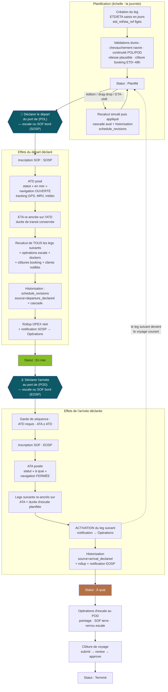

# PLN-SEQ — Séquence de planification déclarative (départ / arrivée)

> Livré le 2026-09-01 (branche `claude/practical-mayer-rphihj`). Reprise de la
> logique de gestion du planning : la vie d'un leg suit désormais une séquence
> déclarative unique, sans chevauchement, avec recalculs automatisés et
> historisation de **tous** les mouvements de dates.

## 1. Le modèle en une phrase

Un leg vit la séquence **planifié → en mer → à quai → terminé** ; les deux
transitions du milieu sont **déclarées** (par l'opérateur d'escale ou par le
SOF du bord), tout le reste (SOF, statut, recalculs, historique, finance,
notifications, activation du leg suivant) en découle automatiquement.

## 2. Vocabulaire des dates

| Champ | Sens | Qui l'écrit |
|---|---|---|
| `etd_ref` / `eta_ref` | Référence **figée** à la création — base de la dérive | `create_leg` uniquement |
| `etd` / `eta` | Prévisionnel **courant** (saisi à la **journée**) | Planning (fiche, Gantt), ETA-shift bord, cascade, re-ancrage au départ déclaré |
| `atd` / `ata` | **Réel** déclaré (heure précise) | `voyage_transitions.declare_departure` / `declare_arrival` — chemin unique |

Doctrine transverse : tout calcul « où en est le voyage » lit le réel dès
qu'il existe, le prévisionnel sinon — helpers canoniques
`planning.effective_etd(leg)` / `planning.effective_eta(leg)`.

## 3. Chaîne de séquence fonctionnelle

**Incident de reprogrammation** : si le recalcul aval devrait déplacer un leg
déjà appareillé, rien n'est écrasé (règle d'or « on ne touche jamais un fait
réalisé »), l'incident est tracé (`summary.skipped`) **et notifié** aux
Opérations (`cascade_blocked`), en plus des alertes dashboard existantes
(retard d'arrivée, ETA dépassée, conflit de port) et du bandeau d'audit du
Gantt (chevauchements, ruptures de continuité, dérives ≥ 4 h).

## 4. Statut stocké vs phase affichée

La machine à états **stockée** ne change pas
(`planned / in_progress / completed / cancelled`,
`services.planning.refresh_leg_status`, seule autorisée à écrire
`leg.status`). La **phase** opérationnelle est dérivée et affichée
(`Leg.phase`) : `planifie → en_mer (ATD) → a_quai (ATA) → termine (clôture
approuvée)`. Décision : ne pas élargir l'enum stockée — trop de consommateurs
de `status` ; la phase répond au besoin d'affichage « en mer / à quai » sans
migration de données ni risque de régression.

## 5. Les deux canaux de déclaration

| Canal | Écran | SOF | Horodatage |
|---|---|---|---|
| Escale (terre) | `/escale` → « Déclarer le départ du port de {POL} » / « Déclarer l'arrivée au port de {POD} » | inscrit automatiquement (SOSP/EOSP) s'il n'existe pas | saisi par l'opérateur (heure précise) |
| Bord | `/captain` → saisie SOF `SOSP` / `EOSP` (+ backstop à la signature) | le SOF **est** le déclencheur | `occurred_at` du SOF (plus jamais « maintenant ») |

Les deux canaux convergent sur `services.voyage_transitions` : mêmes gardes,
mêmes recalculs, même historisation. Re-déclarer au même horodatage est sans
effet (idempotence) ; à un horodatage différent, c'est une **correction
tracée** (ancienne → nouvelle valeur dans l'historique).

## 6. Historisation

`schedule_revisions` (append-only, survit à la suppression du leg) porte
désormais aussi les mouvements du réel : colonnes `old_atd/new_atd/
old_ata/new_ata` (migration `0136`), sources `departure_declared` /
`arrival_declared`. Chaque événement partage un `batch_id` avec ses recalculs
aval (`source="cascade"`, `trigger_leg_id`). Viewer : fiche leg → bouton
« Historique ». L'audit trail (`activity_logs`) et le journal d'escale unifié
restent complémentaires.

## 7. Granularité de saisie

La **planification** se saisit à la journée (`<input type="date">` sur
ETD/ETA/clôture booking, suggestion et Gantt drag-drop snappés au jour). Le
**réel** (déclarations, SOF) garde l'heure précise. L'ETA re-ancrée au départ
hérite de la précision du réel.

## 8. Ce qui reste connu et assumé (non traité ici)

- Le sélecteur de fuseau du formulaire d'horodatage escale reste décoratif
  (saisie interprétée en UTC) — à traiter séparément (ESC-07).
- Le facteur d'émission MRV est daté sur l'ETD (choix de stabilité du
  référentiel) — à arbitrer avec le métier.
- `vessel_readiness` / `crew_border_police_pdf` ne lisent que les affectations
  rattachées à un leg (angle mort documenté côté équipage).
- La page publique `planning_share` continue d'annoncer ETD/ETA prévisionnels
  (document commercial) ; seul le transit affiché passe au réel.
